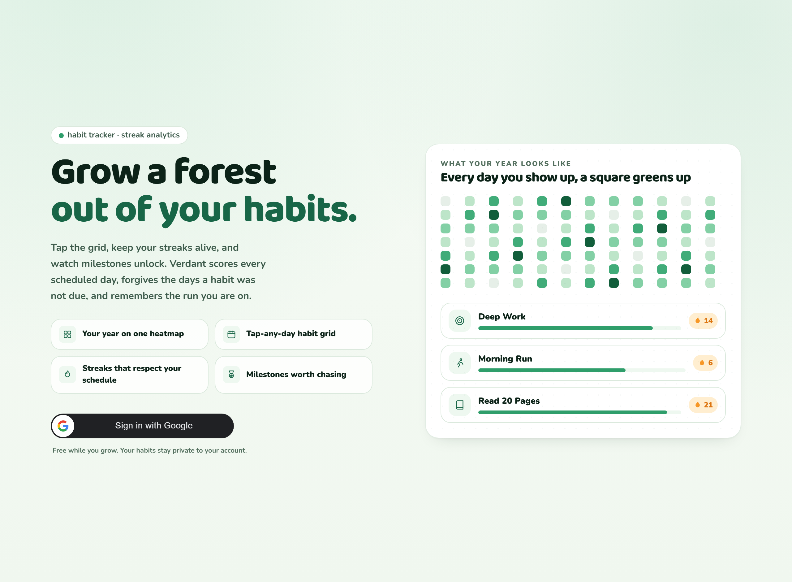
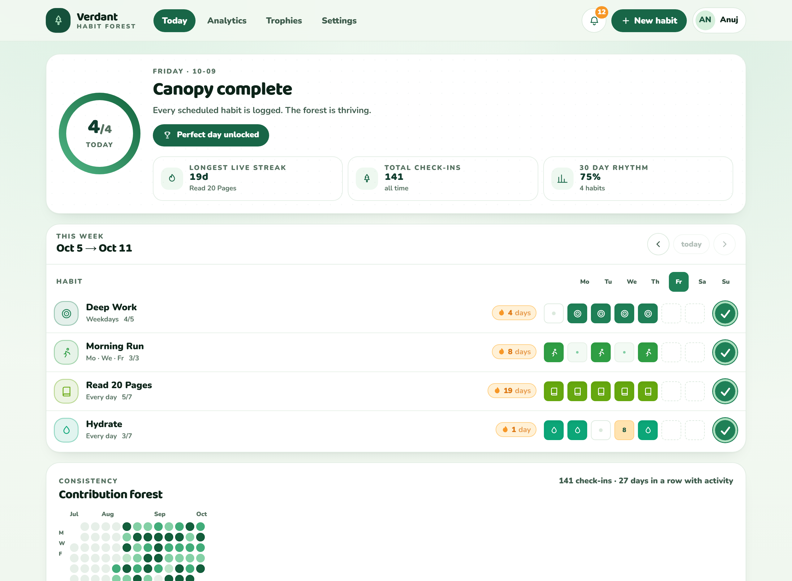
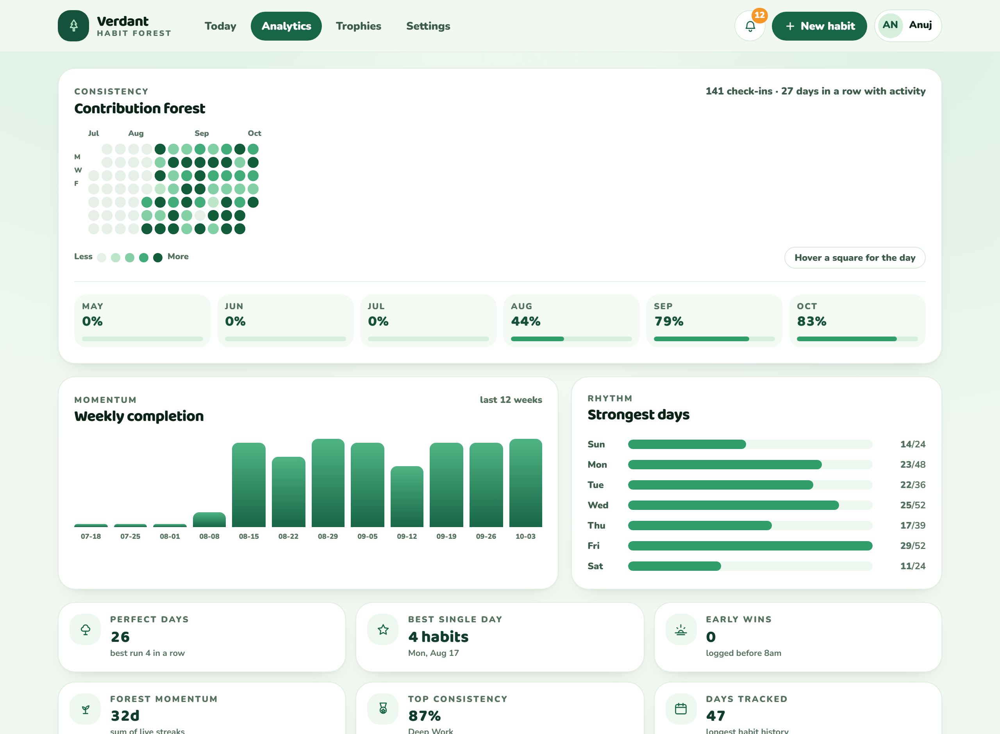
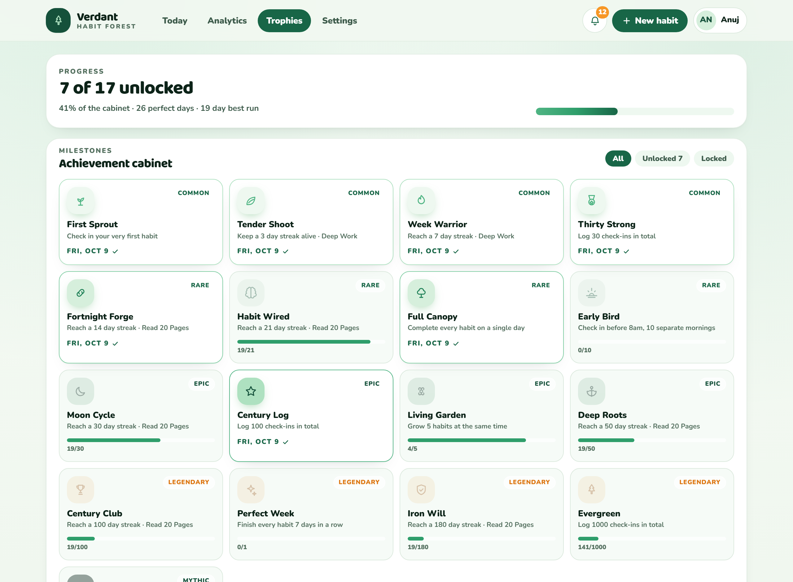

# Verdant — Personal Habit Tracker & Streak Analytics

A gamified habit tracker where you define daily habits, tick them off a visual matrix, keep streaks alive, and unlock milestone achievements. Every scheduled day is scored, days a habit was not due are forgiven, and the run you are on is remembered.

| | |
|---|---|
| Frontend | React 18 · Vite 5 · Tailwind 3 · Framer Motion 11 |
| Backend | Node.js · Express 4 · REST API · node-cron |
| Database | MongoDB Atlas (Users → Habits → Daily Log History) |
| Auth | Google Identity Services (ID token verified server-side) |
| Language | Plain JavaScript — no TypeScript |

## The app

### Sign in with Google



### Today — streak pulse, week matrix, contribution forest



### Analytics — weekly momentum, weekday rhythm, streak leaderboard, insight cards



### Trophies — 17 milestones across five rarity tiers



## Features

- **Week matrix grid** — every habit × every day of the week, tap any past day to log or undo. Drag rows to reorder.
- **GitHub-style contribution heatmap** — a year of check-ins rendered as a continuous forest, trimmed to your first active day.
- **Schedule-aware streak engine** — a `Mon · Wed · Fri` habit does not lose its streak on a Tuesday. Off-schedule days count as bonus credits.
- **Daily targets** — habits can require N completions a day (e.g. 8 glasses of water) with a live `3/8` counter.
- **17 achievements in 5 rarities** — common → mythic, each with its own glyph and colour, unlocked server-side.
- **Cron day rollover** — a scheduled job settles past days at the day boundary and emits milestone, perfect-day, streak-saved, streak-at-risk and streak-lost notifications.
- **Timezone correct** — day keys are computed with `Intl.DateTimeFormat` in the user's zone and are DST-safe.
- **Optimistic UI** — check-ins update instantly and reconcile with the server response; failures roll back with a toast.
- **Animated, transform-only motion** — Framer Motion drives entrance, hover, layout and celebration animations off `transform`/`opacity` so interactions stay smooth, with `prefers-reduced-motion` respected.
- **Accessible** — labelled icon buttons, keyboard shortcuts (`n` new habit, `r` refresh, `1-9` toggle a row, `←/→` change week, `Esc` close), WCAG-checked contrast, Lighthouse 100 on accessibility, best practices and SEO.

## Architecture

```
.
├── server/            Express REST API
│   ├── src/lib/       day keys, streak engine, achievements, validation
│   ├── src/models/    User, Habit, CheckIn, Notification
│   ├── src/routes/    auth, habits, dashboard, notifications, system, health
│   ├── src/services/  check-ins, dashboard, stats, rewards
│   └── src/jobs/      cron day-rollover
├── web/               React SPA
│   └── src/           components, pages, state (context store), lib
└── render.yaml        one service: builds the SPA, serves it and the API
```

**Data model** — `User` owns many `Habit`s; each `Habit` owns many `CheckIn` logs keyed by `dayKey` (`YYYY-MM-DD`) with a unique `{ habit, dayKey }` index, so a day is upserted rather than duplicated. `Notification` rows carry a unique `dedupeKey` so the same milestone never alerts twice.

**Session** — login posts the Google ID token to `POST /api/auth/google`; the server verifies it against the client ID, upserts the user, and returns a signed JWT in an `httpOnly` cookie. No token is ever exposed to JavaScript.

## Run locally

Requires Node 20.19+ and [pnpm](https://pnpm.io).

```bash
pnpm install
cp server/.env.example server/.env      # fill in Atlas URI, client ID, JWT secret
cp web/.env.example web/.env            # paste your Google client ID, leave VITE_API_URL empty
pnpm dev                                # API on :8787, web on :5173
```

| Script | What it does |
|---|---|
| `pnpm dev` | API + web dev servers together (Vite proxies `/api` to `:8787`) |
| `pnpm build` | Builds the SPA into `web/dist` |
| `pnpm start` | Runs the API, which also serves `web/dist` on one port |
| `pnpm db:check` | Connects to Atlas and reports the collections |
| `pnpm health` | Prints `GET /health` from the local API |

## Environment variables

Never commit real values — both `.env` files are git-ignored.

**`server/.env`**

| Key | Notes |
|---|---|
| `MONGODB_URI` | Atlas connection string |
| `MONGODB_DB` | Database name, defaults to `verdant` |
| `GOOGLE_CLIENT_ID` | OAuth **Web application** client ID |
| `JWT_SECRET` | 48+ random bytes; Render can generate it |
| `WEB_ORIGIN` / `ALLOWED_ORIGINS` | Comma-separated list of allowed browser origins |
| `SECURE_COOKIE` | Auto-true when `NODE_ENV=production`; marks the session cookie `Secure` |
| `CRON_ENABLED` / `CRON_SCHEDULE` | Day-rollover job |
| `PORT` | Render injects this automatically |

**`web/.env`**

| Key | Notes |
|---|---|
| `VITE_GOOGLE_CLIENT_ID` | Same client ID as the server |
| `VITE_API_URL` | **Leave empty** when the API is proxied or same-origin. Set to `https://<api>.onrender.com` only for direct cross-origin calls. |

## Deploy

Everything runs as **one Render web service**: the build step compiles the SPA into `web/dist`, and Express serves that folder and the `/api` routes from the same origin. No CORS configuration, no cross-site cookies, no second host.

### 1. Create the service

Push this repo to GitHub, then in Render choose **New → Blueprint** and select it. `render.yaml` creates a Node web service in `singapore` that runs:

```
build:  pnpm install --frozen-lockfile --ignore-scripts && pnpm --filter @verdant/web run build
start:  pnpm --filter @verdant/server run start
health: /health
```

`--ignore-scripts` is deliberate: pnpm refuses to run unapproved package build scripts in CI and fails the install outright. esbuild gets its binary from a platform-specific optional dependency rather than its `postinstall`, so the Vite build works without it.

### 2. Set the environment

`JWT_SECRET` is generated by Render. Fill in the three marked `sync: false` in **Environment** (they are never committed):

| Key | Value |
|---|---|
| `MONGODB_URI` | Your Atlas connection string |
| `GOOGLE_CLIENT_ID` | The OAuth Web client ID |
| `VITE_GOOGLE_CLIENT_ID` | The **same** client ID — the SPA reads it at build time |
| `NODE_ENV` | `production` (already set by the blueprint) |

`VITE_GOOGLE_CLIENT_ID` is compiled into the JavaScript bundle, so changing it needs **Manual Deploy → Clear build cache & deploy**; a plain restart will not pick it up. Without it the login page shows *"Sign-in is not configured yet."*

`WEB_ORIGIN` and `ALLOWED_ORIGINS` are only needed if you later split the frontend onto another host — same-origin requests are accepted automatically.

### 3. Allow Render to reach Atlas

Atlas → **Security → Network Access** → add Render's **egress IP list** for your region. Copy them from the Render service's *Information* page.

### 4. Register the origin with Google

Google Cloud Console → APIs & Services → Credentials → your Web client → **Authorized JavaScript origins**, add the Render URL:

```
https://<your-service>.onrender.com
```

Keep your local ones there too if you develop with Google sign-in:

```
http://localhost:5173
http://127.0.0.1:5173
http://localhost:8787
http://127.0.0.1:8787
```

Rules: exact scheme, no trailing slash, no path. Preview deploys get their own URLs and must be added separately (Google allows 100 origins, no wildcards). While the consent screen is in **Testing**, add your Gmail under **Audience → Test users** or sign-in is blocked.

**Authorized redirect URIs can stay empty** — this app uses the ID-token flow (`google.accounts.id` renders the button, the server calls `verifyIdToken`), which never redirects.

### Your URL

| What | URL |
|---|---|
| Live app | `https://<render-service>.onrender.com` |
| API | `https://<render-service>.onrender.com/api/...` |
| Health check | `https://<render-service>.onrender.com/health` |

Render assigns `<render-service>.onrender.com` from the service name; rename it under **Settings → General** to get a nicer slug such as `https://verdant.onrender.com`, then re-register that exact origin with Google.

## API

All endpoints return `{ ok, ... }` and errors as `{ ok: false, error: { message } }`.

| Method | Path | Purpose |
|---|---|---|
| `GET` | `/health`, `/api/health` | Liveness plus MongoDB connection state |
| `POST` | `/api/auth/google` | Exchange an ID token for a session |
| `GET` / `PATCH` | `/api/auth/me` | Read or update the profile |
| `POST` | `/api/auth/logout` | Clear the session |
| `GET` | `/api/dashboard` | Full dashboard: habits, streaks, heatmap, achievements |
| `GET` | `/api/dashboard/heatmap` | Contribution grid on its own |
| `GET` / `POST` | `/api/habits` | List / create |
| `POST` | `/api/habits/reorder` | Persist row order |
| `PATCH` / `DELETE` | `/api/habits/:id` | Update / delete |
| `POST` | `/api/habits/:id/check-in` | Toggle, set a count, or apply a delta on any day |
| `GET` / `POST` | `/api/notifications` | Inbox / mark read |
| `DELETE` | `/api/notifications/:id` | Dismiss one alert |
| `POST` | `/api/rollover` | Manually re-run the day-boundary job for the signed-in user |

## Security notes

- Helmet CSP, locked to self + Google + Google Fonts.
- Rate limiting separated for auth and general API traffic.
- Every request body validated with `zod`; unknown habit icon names are rejected against an enum.
- CORS is an explicit origin allow-list, not a wildcard.
- Session cookies are `httpOnly`, `SameSite=Lax`, and `Secure` in production.
- Mongo connection strings and secrets are never logged or returned by `/health`.

## Free-tier caveat

Render's free web service sleeps after ~15 minutes without traffic, so the first request after a gap takes several seconds and the cron job does not run while it is asleep. Upgrade to a paid instance, or keep it warm with an external pinger against `/health`, if you want rollover to fire on schedule.
